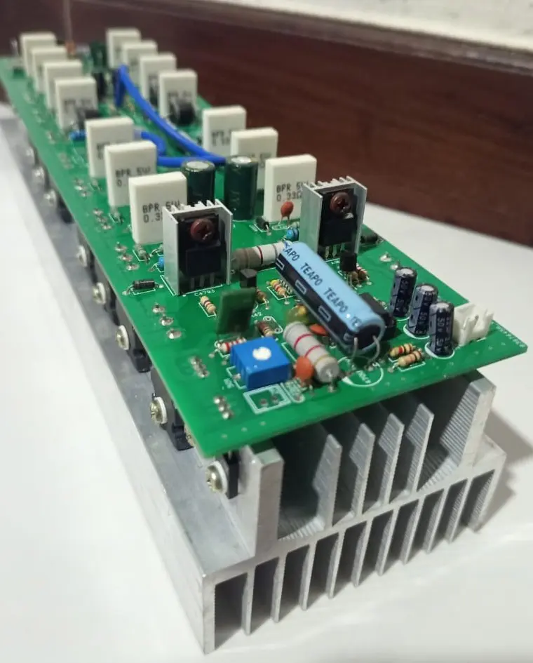
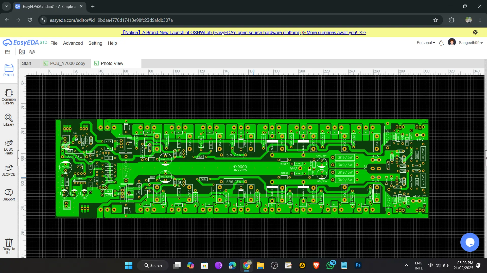
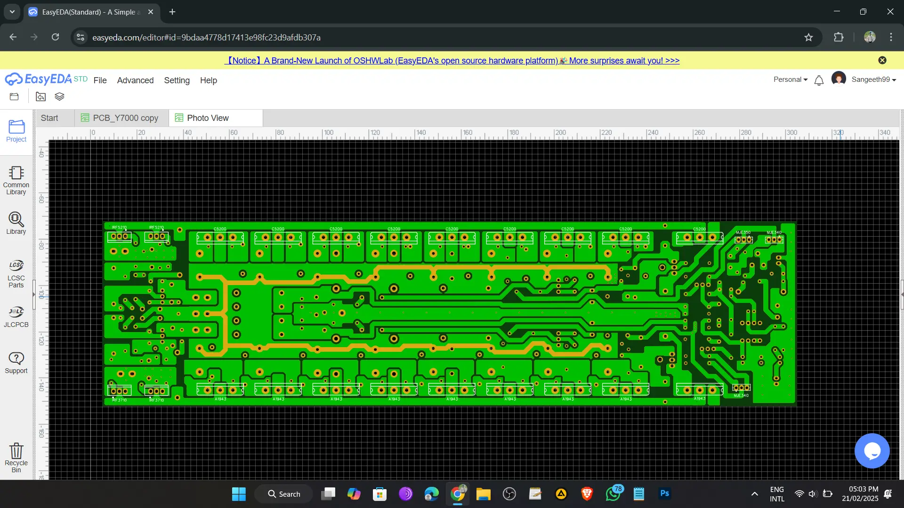
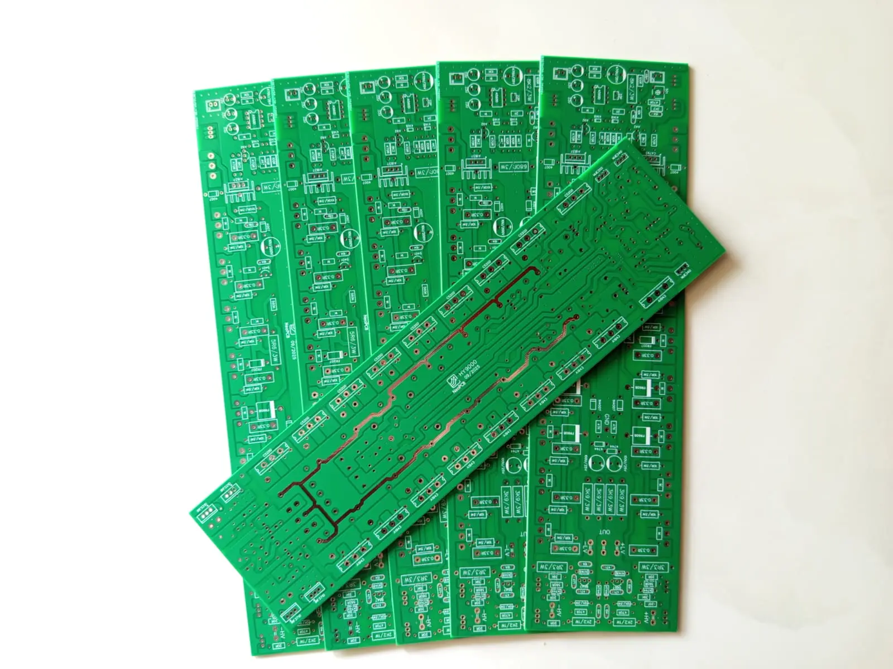

# 🔊 1200W Class-H Professional Audio Amplifier PCB Design

  

High-efficiency Class-H amplifier PCB designed for powerful, stable, and low-heat audio performance.

---

# 📌 Project Overview

This project presents the design and fabrication of a **1200W Class-H professional audio amplifier PCB**, developed through a reverse engineering process.

The objective was to analyze an existing amplifier system and redesign a **reliable and optimized PCB layout** suitable for high-power audio applications. The final design ensures stable performance, efficient power usage, and durability under demanding conditions.

---

# ⚡ Problem

High-power amplifier design involves challenges such as **thermal management, high-current handling, power efficiency, and maintaining audio signal quality**, especially when working with reverse-engineered systems.

---

# ✅ Solution

A fully optimized PCB was developed by redesigning the amplifier layout with focus on **high-current trace routing, grounding, thermal performance, and noise reduction**. The use of a **Class-H architecture with dual voltage rails** improves efficiency and reduces heat generation while maintaining stable output performance.

---

# 🧠 System Architecture

The amplifier is based on a **Class-H topology**, where the system dynamically switches between **±60VDC and ±120VDC power rails** depending on signal demand to improve efficiency.

The output stage uses **8 pairs of C5200 and A1943 power transistors** to handle high current loads. The PCB layout is optimized for power distribution, grounding, and noise reduction, ensuring stable and reliable operation under high power conditions.

---

# 🔩 Hardware Specifications

- Output Power: **1200W**  
- Amplifier Type: **Class-H**  
- Power Supply: **±120VDC / ±60VDC Dual Rails**  
- Power Transistors: **C5200 / A1943 (8 Pairs)**  
- PCB Type: **FR4 Double Layer Epoxy Board**  

---

# 🧾 PCB Design

The PCB was designed using:

- **EasyEDA**  
- **Altium Designer**  

Key design considerations:

- High-current trace optimization  
- Thermal management  
- Noise reduction and grounding  
- Efficient component placement  

The board was fabricated using a **double-layer FR4 PCB**, ensuring durability and reliable performance for professional audio systems.

---

# 🖼️ Hardware & PCB Preview

## 🔹 Complete Amplifier

  

## 🔹 PCB Design – Top Layer

  

## 🔹 PCB Design – Bottom Layer

  

## 🔹 Fabricated PCB

  

---

# 🛠️ Technologies Used

### PCB Design
- EasyEDA  
- Altium Designer  

### Hardware
- C5200 / A1943 Power Transistors  
- FR4 Double Layer PCB  

### Design Method
- Reverse Engineering  

---

# ⚠️ Note

This is a **commercial project**, so the source design files are not publicly available in this repository.

If you need access to the source files for **research, development, or implementation purposes**, please contact:

📧 **wtsangeeth99@gmail.com**

---

# 👨‍💻 Author

**Tharusha Sangeeth**  
Electronics & Embedded Systems Developer  

---

# 📜 License

This project is shared for **educational and demonstration purposes only**.

---
